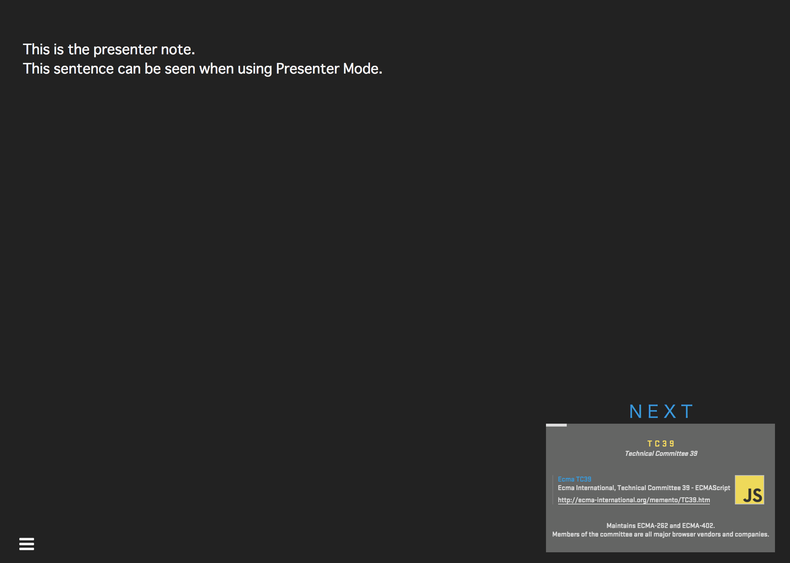

<div align="center">
  <h1>Fusuma</h1>
</div>

<div align="center">
  <strong>📝 easily make slides with markdown</strong>
</div>

[](https://www.npmjs.com/package/fusuma)

Just write down the markdown and make the cool slide.

_Move core codes from [hiroppy/slides](https://github.com/hiroppy/slides)._

## Demo

* [the present and future of JavaScript](https://slides.hiroppy.me/the-present-and-future-of-JavaScript/)

## Directory Structure

Please see [samples](/samples)

```
.
├── .fusumarc.yml       <-- a configuration file
├── index.js            <-- optional for rewriting
├── slides              <-- slides written by Markdown or HTML
│   ├── 0-title.md
│   ├── 01-content.md
│   ├── 02-body
│   │   └── 0-title.md
│   └── 03-end.md
└── style.css           <-- optional for rewriting

2 directories, 7 files
```

## Install

Node version is over 8.

```sh
$ npm i fusuma --save-dev # or npm i fusuma -g

# if you want to use yarn
$ yarn add fusuma --dev
```

## Usage

```sh
   fusuma 0.0.1
   USAGE

     fusuma <command> [options]

   COMMANDS

     start               Start with webpack-dev-server
     build               Build with webpack
     init                Create a configure file
     deploy              Deploy to GitHub pages
     help <command>      Display help for a specific command

   GLOBAL OPTIONS

     -h, --help         Display help
     -V, --version      Display version
     --no-color         Disable colors
     --quiet            Quiet mode - only displays warn and error messages
     -v, --verbose      Verbose mode - will also output debug messages
```

### Init

Generate a configuration file for Fusuma.  
The configuration file's name is `.fusumarc.yml`.

### start

Run with webpack-dev-server.

### Build

Build slides using webpack and output to `dist`.

### Deploy

TODO

## .fusumarc.yml

```yaml
meta:
  url: https://slides.hiroppy.me
  name: the present and future of JavaScript
  author: Yuta Hiroto
  description: Explain how specifications are determined and how it will be in the future.
  thumbnail: https://avatars1.githubusercontent.com/u/1725583?v=4&s=200
  siteName: slides.hiroppy.me
slide:
  theme: js
extends:
  css: style.css
```

### Theme

Provide themes.

## Slide Syntax

All slides are written in HTML or markdown.

### Contents

Get the content of the slide and display it as a list in the sidebar.

#### Slide

```md
<!-- contents -->

## Contents
```

### Background

Change the slide's background.

#### Slide

```md
<!-- background: xxx -->

## title
```

#### CSS

```css
.bespoke-backdrop.xxx {
  background: red;
}
```

### Section Title

This is the common setting of the slide for the title of the section.

#### Slide

```md
<!-- sectionTitle -->

## title
```

#### CSS

```css
.bespoke-backdrop.section-title {
  background: red;
}

.section-title h2 {
  color: var(--color-js);
}
```

### Presenter Note

#### Slide

```md
## title

<!-- note
This is the presenter note.
This sentence can be seen when using Presenter Mode.
-->
```



## Presenter Mode

Click the rocket(:rocket:) icon from the bottom right menu(三) and then slides for presentation will be opened as a new window, and an already open window will be windows for presenters.

Host: `?presenter=host`  
View: `?presenter=view`
